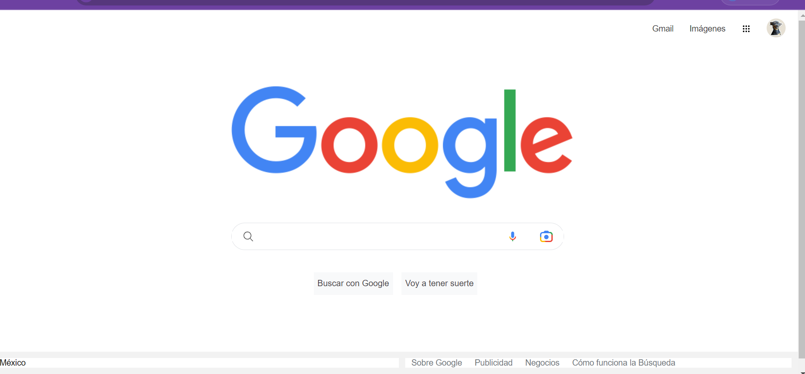

# Clon del navegador de Google

proyecto realizado como practica del botcamp de tecnolochicas

## ¿que construí?

En este proyecto tuve como proposito construir la clonacion de la interfaz del navegador de Google.
Contiene los siguientes elementos:

* Header
* Main
* Footer

## ¿Qué tecnologías utilicé?

## Mi objetivo es:

Aprender a utilizar los distintos lenguajes y las etiquetas principales de CSS y HTML.

## mira aqui mi proyecto:

## 🔗 Links

